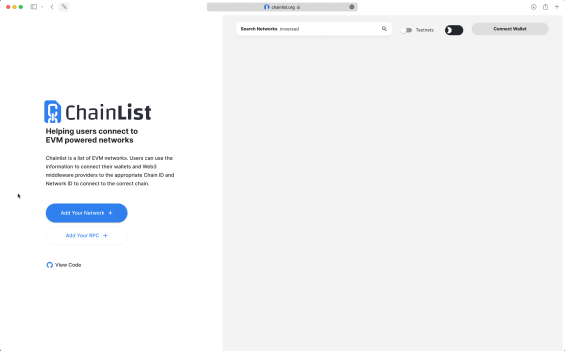
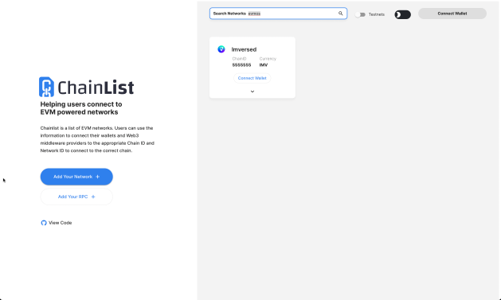

# MetaMask

The [MetaMask](https://metamask.io/) browser extension is a wallet for accessing Ethereum-enabled applications and managing user identities. It can be used to connect to Imversed through the official testnet or via a locally-running Imversed node.

> Chainlist is a list of RPCs for EVM(Ethereum Virtual Machine) networks. Use the information to connect your wallets and Web3 middleware providers to the appropriate Chain ID and Network ID. Find the best RPC for both Mainnet and Testnet to connect to the correct chain

## Adding a New Network

Open the MetaMask extension on your browser, you may have to log in to your MetaMask account if you are not already. Then click the top right circle and go to `Settings` > `Networks` > `Add Network` and fill the form as shown below.

> You can also lookup the [EIP155](https://github.com/ethereum/EIPs/blob/master/EIPS/eip-155.md) Chain ID by referring to [chainlist.org](https://chainlist.org/). Alternatively, to get the full Chain ID from Genesis, check the Chain IDdocumentation page.

Here is the list of fields that you can use to paste on Metamask:

:::: tabs ::: tab Mainnet
* **Network Name:** Imversed Canary
* **New RPC URL:** https://jsonrpc-endpoint-canary.imversed.com:443
* **Chain ID:** 5555555
* **Currency Symbol (optional):** IMV
* **Block Explorer URL (optional):** https://txe-canary.imversed.com
* **Network Name:** Imversed Testnet
* **New RPC URL:** https://jsonrpc-endpoint-test.imversed.com:443
* **Chain ID:** 5555558
* **Currency Symbol (optional):** IMV
* **Block Explorer URL (optional):** https://txe-test.imversed.com
* **Network Name:** Imversed Local
* **New RPC URL:** http://localhost:8545/
* **Chain ID:** 1234
* **Currency Symbol (optional):** IMV
* **Block Explorer URL (optional):** n/a ::: ::::

## Import Account to Metamask
### Automatic Import
Once you have added Imversed to the Metamask `Networks`, you can automatically import your accounts by:

1. Go to the official EVM Chain ID Registry website: [chainlist.org](https://chainlist.org/)
2. Search for "Imversed"
   
3. Click the `Connect Wallet` button under `Imversed Testnet`
   

### Manual Import
Close the `Settings`, go to `My Accounts` (top right circle) and select `Import Account`. You should see an image like the following one:

Now you can export your private key from the terminal using the following command. Again, make sure to replace `mykey` with the name of the key that you want to export and use the correct `keyring-backend`:

```shell
Imversedd keys unsafe-export-eth-key mykey
```

Go back to the browser and select the `Private Key` option. Then paste the private key exported from the `unsafe-export-eth-key` command.

Your account balance should show up as `1 tIMV` and do transfers as usual.

> If it takes some time to load the balance of the account, change the network to `Main Ethereum Network` (or any other than `Localhost 8545` or `Goerli`) and then switch back to `Imversed`.

## Reset Account
If you used your Metamask account for a legacy testnet/mainnet upgrade, you will need to reset your account in order to use it with the new network. This will clear your account's transaction history, but it won't change the balances in your accounts or require you to re-enter your `Secret Recovery Phrase`.

> Make sure you download your **account state** to persist public account addresses and transactions before clearing your wallet accounts.

Go to `Settings` >` Advanced` and click the `Reset Account` button as shown below:

## Download Account State
To see your Metamask logs, click the top right circle and go to `Settings` > `Advanced` > `State Logs`. If you search through the JSON file for the account address you'll find the transaction history.
