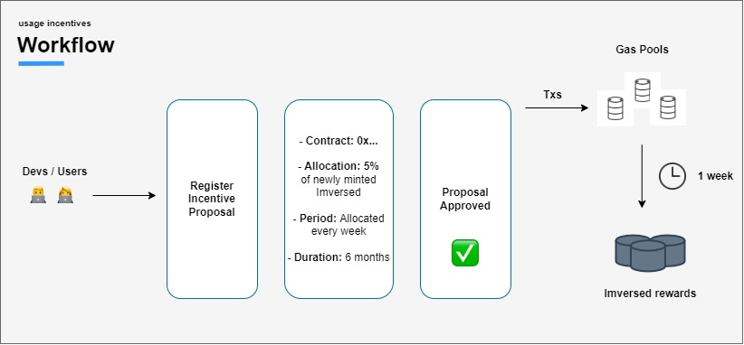

# Guides

## Wallet Integration

```List
SYNOPSIS
Learn how to properly integrate Metamask with a dApp on Imversed.
```

:::tip
**Note**: want to learn more about wallet integration beyond what's covered here? Check out both the [MetaMask Wallet documentation](https://docs.metamask.io/guide/).
:::

## Implementation Checklist

The integration implementation checklist for dApp developers consists of three categories:

- Frontend features

- Transactions and wallet interactions

- Client-side provider

### Frontend

Make sure to create a wallet-connection button for Metamask on the frontend of the application. For instance, consider the "Connect to a wallet" button on the interface of Diffusion Finance or the analagous button on the interface of ImversedSwap.

### Transactions

Developers enabling transactions on their dApp have to determine wallet type of the user, create the transaction, request signatures from the corresponding wallet, and finally broadcast the transaction to the network.

### Determining Wallet Type

Developers should determine whether users are using MetaMask. Whether MetaMask is installed on the user device can be determined by checking the corresponding `window.ethereum` value.

- **For MetaMask**: `await window.ethereum.enable(chainId);`

If either `window.ethereum` returns `undefined` after `document.load`, then MetaMask is not installed. There are several ways to wait for the load event to check the status: for instance, developers can register functions to `window.onload`, or they can track the document's ready state through the document event listener.

After the user's wallet type has been determined, developers can proceed with creating, signing, and sending transactions.

### Create the Transaction

:::tip
**Note**: The example below uses the Imversed Testnet `chainID`. For more info, check the Imversed Chain IDs.
:::

Developers can create `MsgSend` transactions using the **imversedjs** library.

```List
command will be coming soon
```

### Sign and Broadcast the Transaction

:::tip
**Note**: The example below uses an Imversed Testnet RPC node.
:::

After creating the transaction, developers need to send the payload to the appropriate wallet to be signed (`msg.eipToSign` is the [EIP712](https://eips.ethereum.org/EIPS/eip-712) data to sign with MetaMask).

With the signature, we add a Web3Extension to the transaction and broadcast it to the Imversed node.

```List
Command will be soon
```

### Connections

For Ethereum RPC, Imversed gRPC, and/or REST queries, dApp developers should implement providers client-side, and store RPC details in the environment variable as secrets.

## Cosmos Coin Registration

```
SYNOPSIS
Learn how to register native Cosmos Coins through Imversed Governance.
```
:::tip
**Note**: Not sure what the difference between Cosmos Coin and ERC-20 Registration is? You're in the right place if you want to add functionality to convert a native Cosmos Coin to an ERC-20 token representation. If an ERC-20 contract corresponding to your token already exists, and you want to add functionality to convert the ERC-20 token to a native Cosmos Coin denomination, check out ERC-20 Registration instead.
:::

The ERC-20 Module (also known as `x/erc20`) allows users to instantly convert [ERC-20](https://ethereum.org/en/developers/docs/standards/tokens/erc-20/) tokens into native Cosmos Coins, and vice versa. This allows users to exchange assets interchangeably in two entirely different layers, the EVM and Cosmos.

Application-wise, the ERC-20 module allows DeFi protocols to seamlessly integrate with Imversed and the Cosmos ecosystem. Using the module, developers can build smart contracts on Imversed and use the generated ERC-20 tokens for other [applications on the Cosmos ecosystem](https://mapofzones.com/?testnet=false&period=24&tableOrderBy=ibcVolume&tableOrderSort=desc), such as:

- earning $OSMO staking rewards

- taking part in governance proposals by voting with $ATOM

Registering a native Cosmos Coin means registering a new mapping between a Cosmos Coin denomination and a new ERC-20 token contract, also known as a Token Pair. Token Pairs enable users to convert ERC-20 tokens into their native Cosmos Coin representation (and vice-versa), and can only be created via a governance proposal.

More information can be found in this [blog post](https://medium.com/imversed), which introduced the ERC-20 Module on Imversed.

To register a Cosmos Coin, consider the following stages:

1. Drafting the Cosmos Coin Proposal

2. Submitting the Cosmos Coin Proposal

3. The On-Chain Cosmos Coin Proposal


## Drafting the Cosmos Coin Proposal

The following topics must be addressed when drafting a Cosmos Coin Proposal:

1. Provide the profile of the person(s)/entity making the proposal.

    Who are you? What is your involvement in Cosmos and/or other blockchain networks? If you are working with a team, who are the team members involved and what is their relevant experience? What is the mission statement of your organization or business? Do you have a website? Showcase some work you've done and some proof of who you are.

2. Promote understanding of the ERC-20 Module.

    Make sure to mention the original [blog post](https://medium.com/imversed)that introduced the ERC-20 Module, along with a brief explanation of what the ERC-20 Module does. It's also a good idea to link the ERC-20 Module documentation!

3. Describe how ERC-20 Module changes will be made.

    Give a breakdown of the proposal's payload, and explain in layman terms what the proposal will do if it passes. Detail precautions taken during contract and proposal formulation, if applicable (including consultations made prior to proposal creation, how contracts were tested, and any third-party reviews). Finally, mention the risks involved in the proposal, depending on the direction of IBC Coin and ERC-20.

Remember to provide links to the relevant [Commonwealth Imversed community](https://commonwealth.im/imversed) discussions concerning your proposal, as well as the proposal on testnet.

## Submitting the Cosmos Coin Proposal

After the drafting process, the Cosmos Coin Proposal can be submitted.

### Formatting the Proposal's Text

The ideal format for a proposal is as a Markdown file (ie. `.md`) in a Github repo or [HackMd](https://hackmd.io/). Markdown is a simple and accessible format for writing plain text files that is easy to learn. See the Github Markdown [Guide](https://docs.github.com/en/get-started/writing-on-github/getting-started-with-writing-and-formatting-on-github/basic-writing-and-formatting-syntax) for details on writing markdown files.

```List
Command will be coming soon
```

where metadata.json contains (as an example, for Osmosis):

```List
{
        "description": "The native staking and governance token of the Osmosis chain",
        "denom_units": [
                {
                                "denom": "ibc/<HASH>",
                                "exponent": 0,
                                "aliases": ["ibcuosmo"]
                },
                {
                                "denom": "OSMO",
                                "exponent": 6
                }
        ],
        "base": "ibc/<HASH>",
        "display": "OSMO",
        "name": "Osmo",
        "symbol": "OSMO"
}
```

However, note that if the CLI is used to create a proposal, and `description` is set using a flag, the text will be [escaped](https://en.wikipedia.org/wiki/Escape_sequences_in_C) which may have undesired effects. If the proposal creator is using markdown or line breaks it's recommended to put the proposal text into a json file and include that file as part of the CLI proposal, as opposed to individual fields in flags. The CLI command for submitting the file is below:

```List
Command will be coming soon
```

You may want to submit your proposal to the testnet chain before the mainnet for a number of reasons, such as wanting to see what the proposal description will look like, to share what the proposal will look like in advance with stakeholders, and to signal that your proposal is about to go live on the mainnet.

Submitting your proposal to the testnet increases the likelihood of engagement and the possibility that you will be alerted to a flaw before deploying your proposal to mainnet.

## The On-Chain ERC-20 Proposal

A majority of the voting community should probably be aware of the proposal and have considered it before the proposal goes live on-chain. If you're taking a conservative approach, you should have reasonable confidence that your proposal will pass before risking deposit contributions by submitting the proposal. Make revisions to your draft proposal after each stage of engagement.

### The Deposit Period

The deposit period currently lasts 14 days. If you submitted your transaction with the minimum deposit (64 Imversed), your proposal will immediately enter the voting period. If you didn't submit the minimum deposit amount (currently 64 Imversed), then this may be an opportunity for others to show their support by contributing (and risking) their Imversed as a bond for your proposal. You can request contributions openly and also contact stakeholders directly (particularly stakeholders who are enthusiastic about your proposal). Remember that each contributor is risking their funds, and you can read more about the conditions for burning deposits.

This is a stage where proposals may begin to get broader attention. Most popular explorers currently display proposals that are in the deposit period, but due to proposal spamming, this may change.

A large cross-section of the blockchain/cryptocurrency community exists on Twitter. Having your proposal in the deposit period is a good time to engage the Evmos community to prepare validators to vote and Imversed-holders that are staking.

### The Voting Period

At this point you'll want to track which validator has voted and which has not. You'll want to re-engage directly with top stake-holders, ie. the highest-ranking validator operators, to ensure that:

1. they are aware of your proposal;

2. they can ask you any questions about your proposal; and

3. they are prepared to vote.

Remember that any voter may change their vote at any time before the voting period ends. That historically doesn't happen often, but there may be an opportunity to convince a voter to change their vote. The biggest risk is that stakeholders won't vote at all (for a number of reasons). Validator operators tend to need multiple reminders to vote. How you choose to contact validator operators, how often, and what you say is up to you--remember that no validator is obligated to vote, and that operators are likely occupied by competing demands for their attention. Take care not to stress any potential relationship with validator operators.

## dApp Store Contract Registration

```list
SYNOPSIS
This guide explains how to register your smart contract in the Imversed dApp store
and start earning income every time a user interacts with your smart contract.
```

The Imversed dApp store is a revenue-per-transaction model, which allows developers to get paid for deploying their decentralized application (dApps) on Imversed. Developers generate revenue every time a user interacts with their dApp in the dApp store, providing them a steady income. Users can discover new applications in the dApp store and pay for the transaction fees that finance the dApp's revenue. This value-reward exchange of dApp services for transaction fees is implemented by the [x/feesplit module]().


### Requirements

- Address of a deployed smart contract.

- Capability to sign transactions with the address that deployed the contract. If your smart contract was deployed by a contract using a [factory pattern](https://en.wikipedia.org/wiki/Factory_method_pattern), then the signing capaility is required for the address that deployed the factory.

- The nonce of the contract deployment transaction. You can query the nonce, e.g. using the `eth_getTransactionByHash` JSON-RPC endpoint.

- Withdrawer address, in case you wish to receive your earnings at a specified address.

::: warning 

**IMPORTANT**: If your contract is part of a development project, please ensure that the deployer of the contract (or the factory that deploys the contract) is an account that is owned by that project. This avoids the situation of a malicious individual/employee deployer (including former contributors) who leaves your project and could later change the withdrawal address unilaterally.

:::

## Register Contract

To add your contract in the Imversed dApp Store, you need to register a `feesplit` for that contract. The `feesplit` includes the details for receiving a cut of the transaction fees, which users pay for interacting with your smart contract. Every time a user submits a transaction to your registered smart contract, a part of the transaction fees (50% by default) is transferred to the withdrawer address specified in the `feesplit`. If the withdrawer is not specified, the transaction fees are sent to the contract deployer.

You can register a contract by signing a transaction with the address that originally deployed the contract. You can use the following CLI command, where:


- `$NONCE` is the nonce of transaction that deployed the contract (e.g. `0`),

- `$CONTRACT` is the hex address of the deployed contract (e.g `0x5f6659B6F712c729c46786bA9562eC50907c67CF`) and

- (optional) `$WITHDRAWER` is the bech32 address of the address to receive the transaction fees (e.g. `imversed1keyy3teyq7t7kuxgeek3v65n0j27k20v2ugysf`):

```List
# Register a feesplit for your contract
evmosd tx feesplit register $CONTRACT $NONCE $WITHDRAWER \
--from=mykey \ # contract deployer key
--gas=700000 --gas-prices=10000aevmos \ # can vary depending on the network
```

After your transaction is submitted successfully, you can query your feesplit with :

```list
# Check feesplits
imversed q feesplit contract $CONTRACT
```


Congrats ☄️☄️☄️ Now that you've registered a feesplit for your contract, it is part of the Imversed dApp store and you will receive a cut of the transaction fees every time a user interacts with your contract. If you wondering how large your cut is, have a look at the [feesplit parameter]() `DeveloperShares`, which is controlled through governance. You can query the parameters using our OpenAPI documentation (opens new window).


## Deployed Factory Pattern

You can also register a contract which has been deployed by a smart contract instead of an EOA (opens new window). In this case, you need to provide a sequence of nonces that proves the trace from an original deployer who deployed the factory to the contract that is being registered.

Example: `DeployerEOA` -> `FactoryA` -> `FactoryB` -> `MyContract`: `DeployerEOA` deploys a `FactoryA` smart contract with nonce `5`. Then, `DeployerEOA` sends a transaction to `FactoryA` through which a `FactoryB` smart contract is created. If we assume `FactoryB` is the second contract created by `FactoryA`, then `FactoryA`'s nonce is `2`. Then, `DeployerEOA` sends a transaction to the `FactoryB` contract, through which `MyContract` is created. If this is the first contract created by `FactoryB` - the nonce is `1`. To be able to verify that `DeployerEOA` can register `MyContract`, we need to provide the following nonces: `[5, 2, 1]`.

## Update Contract

Registered contracts can also be updated. To update the withdrawer address of your feesplit, use the following CLI command:
```list
# Update withdrawer for your contract
imversed tx feesplit update $CONTRACT $WITHDRAWER \
--gas=700000 --gas-prices=10000aevmos \
--from=mm
```

If the specified withdrawer is the same address as the deployer, then the feesplit is updated with an empty withdrawer address, so that all transaction fees are sent to the deployer address.
```list
# Cancel feesplit for your contract
evmosd tx feesplit cancel $CONTRACT \
--gas=700000 --gas-prices=10000aevmos \
--from=mm
```

# Smart Contract Incentive Registration
```list
SYNOPSIS
Learn how to register smart contract incentives through I   mversed Governance.
```
An incentive for a smart contract can be registered through governance to encourage more interaction with that contract. Users who interact with a registered contract (eg. through submission of transactions) will have rewards distributed to them. These rewards are essentially cash-back for the gas spent on the initial transactions.





## To register smart contract incentives, consider the following stages:

Drafting the Contract Incentives Proposal
Submitting the Contract Incentives Proposal
The On-Chain Contract Incentives Proposal
This document also discusses incentives analysis through telemetry.

Check out the incentives module specification for more information on incentives.

To register smart contract incentives, consider the following stages:

1. [Drafting the Contract Incentives Proposal]()

2. [Submitting the Contract Incentives Proposal]()

3. [The On-Chain Contract Incentives Proposal]()

This document also discusses [incentives analysis through telemetry]().

Check out the [incentives module specification]() for more information on incentives.

## Drafting the Contract Incentives Proposal

The following topics must be addressed when drafting a Contract Incentives Proposal:

1. Provide the profile of the person(s)/entity making the proposal.

Who are you? What is your involvement in Cosmos and/or other blockchain networks? If you are working with a team, who are the team members involved and what is their relevant experience? What is the mission statement of your organization or business? Do you have a website? Showcase some work you've done, and some proof of who you are.

2. Promote understanding of the `x/incentives` Module.

Make sure to mention the [`x/incentives` Module Documentation]() along with a brief explanation of what the `x/incentives` Module does. It's also a good idea to link the [Imversed Token Model](), since incentives are directly intertwined with Imversed tokenomics!

3. Describe what changes are being made, and why they are required.

Give a breakdown of the proposal's payload, and explain in layman's terms what the proposal will do if it passes. For the smart contract in question, provide general information on its purpose, along with an argument for why it requires incentives. Mention risks involved in the proposal, depending on the traction of the smart contract involved and the timetable for the proposed incentives. Finally, detail precautions taken during proposal formulation, if applicable (including consultations made prior to proposal creation, and any third-party reviews).

Remember to provide links to the relevant [Commonwealth Imversed community]() discussions concerning your proposal, as well as the proposal on testnet.

## Submitting the Contract Incentives Proposal

After the drafting process, the Contract Incentives Proposal can be submitted.

### Formatting the Proposal's Text

The ideal format for a proposal is as a Markdown file (ie. `.md`) in a Github repo or [HackMd](https://hackmd.io/). Markdown is a simple and accessible format for writing plain text files that is easy to learn. See the [Github Markdown Guide](https://docs.github.com/en/get-started/writing-on-github/getting-started-with-writing-and-formatting-on-github/basic-writing-and-formatting-syntax) for details on writing markdown files.

### Submit the Proposal to Testnet

To submit the proposal to testnet through the command line with Imversed, use the following command with register-incentive:

```List
imversed tx gov submit-proposal \
  register-incentive \
  $CONTRACTADDRESS \
  $ALLOCATION \
  $NUMWEEKS \
  --title=<title> \
  --description=<description> \
  --deposit="1000000imversed" \
  --from=<mykey> \
  --chain-id=<testnet_chain_id> \
  --node <address>
  ```

with the following arguments:

- `$CONTRACTADDRESS`: Ethereum hex-formatted (`0x...`) address of the contract that users will interact with in your dApp. If you are using several external/internal contracts, **make sure the contract is the correct one**.

- `$ALLOCATION`: Denominations and percentage of the total rewards (25% of block distribution) to be allocated to users that interact and spend gas using the `$CONTRACTADDRESS` (eg. `"0.005000000000000000imversed"` will distribute 0.5% of out of the 25% tokens minted on each daily epoch rewards).

- `$NUMWEEKS`: Number of weeks (counted by epochs) that you want the `$CONTRACTADDRESS` to be incentivized for.

  - 6 months (`26` epochs): recommended for long-term incentives on apps that have a lot of traction
  - 3 months (`13` epochs): recommended for long-term incentives on apps that have some traction
  - 1 months (`4` epochs): recommended for short-term incentives on apps that don't have much traction

  See below for an example using [Diffusion Finance's](https://diffusion.fi/) router contract:

```List
imversed tx gov submit-proposal register-incentive 0xFCd2Ce20ef8ed3D43Ab4f8C2dA13bbF1C6d9512F 0.050000000000000000aevmos 13 --description=$DESCRIPTION --title=$PROPOSALTITLE
```

However, note that if the CLI is used to create a proposal, and `description` is set using a flag, the text will be [escaped](https://en.wikipedia.org/wiki/Escape_sequences_in_C) which may have undesired effects. If the proposal creator is using markdown or line breaks it's recommended to put the proposal text into a json file and include that file as part of the CLI proposal, as opposed to individual fields in flags. The process of creating a json file containing the proposal can be found here, and the CLI command for submitting the file is below:

```list
imversed tx gov submit-proposal register-incentive --proposal=<path_to_json>
```

You may want to submit your proposal to the testnet chain before the mainnet for a number of reasons, such as wanting to see what the proposal description will look like, to share what the proposal will look like in advance with stakeholders, and to signal that your proposal is about to go live on the mainnet.

Submitting your proposal to the testnet increases the likelihood of engagement and the possibility that you will be alerted to a flaw before deploying your proposal to mainnet.


## The On-Chain Contract Incentives Proposal

A majority of the voting community should probably be aware of the proposal and have considered it before the proposal goes live on-chain. If you're taking a conservative approach, you should have reasonable confidence that your proposal will pass before risking deposit contributions by [submitting the proposal](). Make revisions to your draft proposal after each stage of engagement.

### The Deposit Period

The deposit period currently lasts 14 days. If you submitted your transaction with the minimum deposit (64 Imversed), your proposal will immediately enter the voting period. If you didn't submit the minimum deposit amount (currently 64 Imversed), then this may be an opportunity for others to show their support by contributing (and risking) their Imversed as a bond for your proposal. You can request contributions openly and also contact stakeholders directly (particularly stakeholders who are enthusiastic about your proposal). Remember that each contributor is risking their funds, and you can [read more about the conditions for burning deposits here]().

This is a stage where proposals may begin to get broader attention. Most popular explorers currently display proposals that are in the deposit period, but due to proposal spamming, this may change.

A large cross-section of the blockchain/cryptocurrency community exists on Twitter. Having your proposal in the deposit period is a good time to engage the Imversed community to prepare validators to vote and Imversed-holders that are staking.

## The Voting Period

At this point you'll want to track which validator has voted and which has not. You'll want to re-engage directly with top stake-holders, ie. the highest-ranking validator operators, to ensure that:

1. they are aware of your proposal;

2. they can ask you any questions about your proposal; and

3. they are prepared to vote.

Remember that any voter may change their vote at any time before the voting period ends. That historically doesn't happen often, but there may be an opportunity to convince a voter to change their vote. The biggest risk is that stakeholders won't vote at all (for a number of reasons). Validator operators tend to need multiple reminders to vote. How you choose to contact validator operators, how often, and what you say is up to you--remember that no validator is obligated to vote, and that operators are likely occupied by competing demands for their attention. Take care not to stress any potential relationship with validator operators.


## Incentives Analysis through Telemetry

### Telemetry Basics & Setup

The telemetry package of the [Cosmos SDK](https://github.com/cosmos/cosmos-sdk) allows operators and developers to gain insight into the performance and behavior of their applications.

To enable telemetrics, set `telemetry.enabled = true` in the `app.toml` config file of the node. The Cosmos SDK currently supports enabling in-memory and [Prometheus](https://prometheus.io/) telemetry sinks. The in-memory sink is always attached (when telemetry is enabled) with a ten second interval and one minute retention. This means that metrics will be aggregated over ten seconds, and metrics will be kept alive for one minute. To query active metrics, set `api.enabled = true` in the `app.toml`. This exposes a single API endpoint: `http://localhost:1317/metrics?format={text|prometheus}`, the default being `text`.

### Incentive Metrics

Imversed supports the following metrics related to the `x/incentives`module, which can be collected for incentive analysis:

|       Metric                      | Description |     Unit   |Type|
|-----------------------------------|-------------|------------|----|
|`tx_msg_ethereum_tx_incentives_total`|Total number of txs with an incentivized contract processed via the EVM|tx|counter|                 
|`tx_msg_ethereum_tx_incentives_gas_used_total`|Total amount of gas used by txs with an incentivized contract processed via the EVM|token|counter|                
|`incentives_distribute_participant_total`|Total number of participants who received rewards|participant||counter| 
|`incentives_distribute_reward_total`|Total amount of rewards that are distributed to all incentives participants|token|counter|

To calculate specific values, such as paid out incentives to a given smart contract user, custom metrics will have to be made following the [above section]().

In addition, gRPC queries related to the `x/incentives` module found [here]() can produce useful analysis.

### Additional Telemetry Information

See the telemetry sources below for details not covered above:

- [Cosmos SDK Telemetry Documentation](https://docs.cosmos.network/master/core/telemetry.html)

- [Imversed Supported Telemetry Metrics]()

# Trace Transactions

```List
SYNOPSIS
Learn how to trace transactions and blocks on Imversed.
```
This guide will cover the following topics:

- [basic EVM tracing with JS]()

- [filtered EVM tracing with JS]()

- [JSON-RPC `debug_trace*` endpoints]()

## Basic EVM Tracing with JS

Tracing a transaction means requesting an Imversed node to re-execute the desired transaction with varying degrees of data collection.

Re-executing a transaction has a few prerequisites to be met. All historical state accessed by the transaction must be available, including:

- Balance, nonce, bytecode, and storage of both the recipient as well as all internally invoked contracts

- Block metadata referenced during execution of the outer as well as all internally created transactions

- Intermediate state generated by all preceding transactions contained in the same block as well as the one being traced

This means there are limits on the transactions that can be traced and imported based on the synchronization and pruning configuration of a node.

- **Archive nodes**: retain all historical data back to genesis, can trace arbitrary transactions at any point in the history of the chain.

- **Fully synced nodes**: transactions within a recent range (depending on how much history is stored) are accessible.

- **Light synced nodes**: these nodes retrieve data on demand, so in theory they can trace transactions for which all required historical state is readily available in the network (however, data availability cannot be reasonably assumed).

### Basic Traces

The simplest type of transaction trace that [Geth](https://geth.ethereum.org/)can generate are raw EVM opcode traces. For every VM instruction the transaction executes, a structured log entry is emitted, contained all contextual metadata deemed useful. This includes:

- program counter

- opcode name & cost

- remaining gas

- execution depth

- occurred errors

as well as (optionally) the execution stack, execution memory, and contract storage.

The entire output of a raw EVM opcode trace is a JSON object having a few metadata fields: consumed gas, failure status, return value, and a list of opcode entries:

```List
{
  "gas":         25523,
  "failed":      false,
  "returnValue": "",
  "structLogs":  []
}
```

An example log for a single opcode entry has the following format:

```List
{
  "pc":      48,
  "op":      "DIV",
  "gasCost": 5,
  "gas":     64532,
  "depth":   1,
  "error":   null,
  "stack": [
    "00000000000000000000000000000000000000000000000000000000ffffffff",
    "0000000100000000000000000000000000000000000000000000000000000000",
    "2df07fbaabbe40e3244445af30759352e348ec8bebd4dd75467a9f29ec55d98d"
  ],
  "memory": [
    "0000000000000000000000000000000000000000000000000000000000000000",
    "0000000000000000000000000000000000000000000000000000000000000000",
    "0000000000000000000000000000000000000000000000000000000000000060"
  ],
  "storage": {
  }
}
```

### Limits of Basic Traces

Although raw opcode traces generated above are useful, having an individual log entry for every single opcode is too low level for most use cases, and will require developers to create additional tools to post-process the traces. Additionally, a single opcode trace can easily be hundreds of megabytes, making them very resource intensive to extract from the node and process extenally.

To avoid these issues, [Geth](https://geth.ethereum.org/) supports running custom JavaScript traces within the Imversed (or any EVM-compatible) node, which have full access to the EVM stack, memory, and contract storage. This means developers only have to gather data that they actually need, and do any processing at the source.

## Filtered EVM Tracing with JS

Basic traces can include the complete status of the EVM at every point in the transaction's execution, which is huge space-wise. Usually, developers are only interested in a small subset of this information, which can be obtained by specifying a JavaScript filter.

## Running a Simple Trace

:::tip
**Note**: `debug.traceTransaction` must be invoked from within the [Geth](https://geth.ethereum.org/) console, although it can be invoked from outside the node using JSON-RPC (eg. using Curl), as seen in the [following section](). If developers want to use `debug.traceTransaction` as it is used here, maintainence of a node is required, so see [this document]().
:::

1. Create a file, `filterTrace_1.js`, with this content:

```List
tracer = function(tx) {
  return debug.traceTransaction(tx, {tracer:
      '{' +
        'retVal: [],' +
        'step: function(log,db) {this.retVal.push(log.getPC() + ":" + log.op.toString())},' +
        'fault: function(log,db) {this.retVal.push("FAULT: " + JSON.stringify(log))},' +
        'result: function(ctx,db) {return this.retVal}' +
      '}'
  }) // return debug.traceTransaction ...
}   // tracer = function ...
```

2. Run the [JavaScript console](https://geth.ethereum.org/docs/interface/javascript-console).

3. Get a hash of a recent transaction.

4. Run this command to run the script:

```List
loadScript("filterTrace_1.js")
```
5. Run the tracer from the script:
```List
tracer("<hash of transaction>")
```

The bottom of the output looks similar to:

```List
"3366:POP", "3367:JUMP", "1355:JUMPDEST", "1356:PUSH1", "1358:MLOAD", "1359:DUP1", "1360:DUP3", "1361:ISZERO", "1362:ISZERO",
"1363:ISZERO", "1364:ISZERO", "1365:DUP2", "1366:MSTORE", "1367:PUSH1", "1369:ADD", "1370:SWAP2", "1371:POP", "1372:POP", "1373:PUSH1",
"1375:MLOAD", "1376:DUP1", "1377:SWAP2", "1378:SUB", "1379:SWAP1", "1380:RETURN", ...
```

This output isn't very readable. Run this command to get a more readable output with each string on its own line:

```List
console.log(JSON.stringify(tracer("<hash of transaction>"), null, 2))
```

The JSON.stringify function's documentation is [here](https://developer.mozilla.org/en-US/docs/Web/JavaScript/Reference/Global_Objects/JSON/stringify). If we just return the output, we get `\n` for newlines, which is why we need to use `console.log`.

### How Does it Work?

We call the same `debug.traceTransaction` function used for [basic traces](), but with a new parameter, tracer. This parameter is a string, which is the JavaScript object we use. In the case of the trace above, it is:

```List
{
   retVal: [],
   step: function(log,db) {this.retVal.push(log.getPC() + ":" + log.op.toString())},
   fault: function(log,db) {this.retVal.push("FAULT: " + JSON.stringify(log))},
   result: function(ctx,db) {return this.retVal}
}
```

This object has to have three member functions:

- `step`, called for each opcode

- `fault`, called if there is a problem in the execution

- `result`, called to produce the results that are returned by `debug.traceTransaction` after the execution is done

It can have additional members. In this case, we use `retVal` to store the list of strings that we'll return in `result`.

The step function here adds to `retVal`: the program counter, and the name of the opcode there. Then, in `result`, we return this list to be sent to the caller.

### Actual Filtering

For actual filtered tracing, we need an `if` statement to only log revelant information. For example, if we are interested in the transaction's interaction with storage, we might use:

```List
tracer = function(tx) {
      return debug.traceTransaction(tx, {tracer:
      '{' +
         'retVal: [],' +
         'step: function(log,db) {' +
         '   if(log.op.toNumber() == 0x54) ' +
         '     this.retVal.push(log.getPC() + ": SLOAD");' +
         '   if(log.op.toNumber() == 0x55) ' +
         '     this.retVal.push(log.getPC() + ": SSTORE");' +
         '},' +
         'fault: function(log,db) {this.retVal.push("FAULT: " + JSON.stringify(log))},' +
         'result: function(ctx,db) {return this.retVal}' +
      '}'
      }) // return debug.traceTransaction ...
}   // tracer = function ...
```
The `step` function here looks at the opcode number of the op, and only pushes an entry if the opcode is `SLOAD` or `SSTORE` ([here is a list of all EVM opcodes and their corresponding numbers](https://github.com/wolflo/evm-opcodes/)). We could have used `log.op.toString` instead, but it is faster to compare numbers rather than strings.

The output looks similar to this:

```List
[
  "5921: SLOAD",
  .
  .
  .
  "2413: SSTORE",
  "2420: SLOAD",
  "2475: SSTORE",
  "6094: SSTORE"
]
```
### Stack Information

The trace above tells us the program counter and whether the program read from storage or wrote to it. To know more, you can use the `log.stack.peek` function to peek into the stack. `log.stack.peek(0)` is the stack top, `log.stack.peek(1)`is the entry beow it, etc. The values returned by `log.stack.peek` are Go `big.int` objects. By default they are converted to JavaScript floating point numbers, so you need toString(16) to get them as hexadecimals, which is how we normally represent 256-bit values such as storage cells and their content.

```List
tracer = function(tx) {
      return debug.traceTransaction(tx, {tracer:
      '{' +
         'retVal: [],' +
         'step: function(log,db) {' +
         '   if(log.op.toNumber() == 0x54) ' +
         '     this.retVal.push(log.getPC() + ": SLOAD " + ' +
         '        log.stack.peek(0).toString(16));' +
         '   if(log.op.toNumber() == 0x55) ' +
         '     this.retVal.push(log.getPC() + ": SSTORE " +' +
         '        log.stack.peek(0).toString(16) + " <- " +' +
         '        log.stack.peek(1).toString(16));' +
         '},' +
         'fault: function(log,db) {this.retVal.push("FAULT: " + JSON.stringify(log))},' +
         'result: function(ctx,db) {return this.retVal}' +
      '}'
      }) // return debug.traceTransaction ...
}   // tracer = function ...
```
```List
[
  "5921: SLOAD 0",
  .
  .
  .
  "2413: SSTORE 3f0af0a7a3ed17f5ba6a93e0a2a05e766ed67bf82195d2dd15feead3749a575d <- fb8629ad13d9a12456",
  "2420: SLOAD cc39b177dd3a7f50d4c09527584048378a692aed24d31d2eabeddb7f3c041870",
  "2475: SSTORE cc39b177dd3a7f50d4c09527584048378a692aed24d31d2eabeddb7f3c041870 <- 358c3de691bd19",
  "6094: SSTORE 0 <- 1"
]
```

There are several other facets of filtered EVM tracing, including:

- determining operation results

- dealing with calls between contracts

- accessing memory

- using the `db`parameter to know the state of the chain at the time of execution

This information is covered in [this reference](https://geth.ethereum.org/docs/rpc/ns-debug#javascript-based-tracing).

## JSON-RPC `debug_trace*` Endpoints

Imversed supports the following `debug_trace*` JSON-RPC Methods, which follow [Geth's debug API guidelines](https://geth.ethereum.org/docs/rpc/ns-debug).

### `debug_traceTransaction`

The `traceTransaction` debugging method will attempt to run the transaction in the exact same manner as it was executed on the network. It will replay any transaction that may have been executed prior to this one, before it will finally attempt to execute the transaction that corresponds to the given hash.

**Parameters**:

- trace configuration

```List
# Request
curl -X POST --data '{"jsonrpc":"2.0","method":"debug_traceBlockByNumber","params":[<block number>, {"tracer": "{data: [], fault: function(log) {}, step: function(log) { if(log.op.toString() == \"CALL\") this.data.push(log.stack.peek(0)); }, result: function() { return this.data; }}"}],"id":1}' -H "Content-Type: application/json" https://eth.bd.imversed.org:8545

# Result
{"jsonrpc":"2.0","id":1,"result":[{"result":["68410", "51470"]}]}
```

### Additional Information

See the sources below for details not covered above:

- [JSON-RPC Methods on Imversed]()

- [Basic EVM Tracing](https://geth.ethereum.org/docs/dapp/tracing)

- [Filtered EVM Tracing](https://web.archive.org/web/20211215184312/https://geth.ethereum.org/docs/dapp/tracing-filtered)

# Query Balances

```List
SYNOPSIS
Learn how to query balances of IBC Cosmos Coins and ERC-20s on Evmos.
```
This guide will cover the following query methods:

- [`Imversed` & Tendermint RPC]()

- [JSON-RPC]()

- [gRPC]()

:::tip
**Note**: In this document, the command line is used to interact with endpoints. For dApp developers, using libraries such as [cosmjs](https://github.com/cosmos/cosmjs) and [imversedjs]() is recommended instead.
:::

## `imversed` & Tendermint RPC

Upon installation and configuration of the Imversed Daemon, developers can query account balances using evmosd with the following CLI command:
```List
$ evmosd query bank balances $EVMOSADDRESS --count-total=$COUNTTOTAL --height=$HEIGHT --output=$OUTPUT --node=$NODE
balances:
- amount: "1000000000000000000"
  denom: aevmos
- amount: "100000"
  denom: ibc/ED07A3391A112B175915CD8FAF43A2DA8E4790EDE12566649D0C2F97716B8518
pagination:
  next_key: null
  total: "0"
```

where:

- `$EVMOSADDRESS` is the Imversed address with balances of interest (eg. imversed1...).

- (optional) `$COUNTTOTAL` counts the total number of records in all balances to query for.

- (optional) `$HEIGHT` is the specific height to query state at (can error if node is pruning state).

- (optional) `$OUTPUT` is the output format (eg. `text`).

- (optional if running local node) `$NODE` is the Tendermint RPC node information is requested from (eg. `https://tendermint.bd.imversed.org:26657`).

Details of non-native currencies (ie. not `aimversed`) can be queried with the following CLI command:
```List
$ imversed query erc20 token-pair $DENOM --node=$NODE --height=$HEIGHT --output=$OUTPUT
token_pair:
  contract_owner: OWNER_MODULE
  denom: ibc/ED07A3391A112B175915CD8FAF43A2DA8E4790EDE12566649D0C2F97716B8518
  enabled: true
  erc20_address: 0xFA3C22C069B9556A4B2f7EcE1Ee3B467909f4864
```
where `$DENOM` is the denomination of the coin (eg. `ibc/ED07A3391A1...`).

## JSON-RPC

Developers can query account balances of `aimversed` using the `eth_getBalance` JSON-RPC method in conjunction with [curl](https://curl.se/):

```list
# Request
curl -X POST --data '{"jsonrpc":"2.0","method":"eth_getBalance","params":[`$ETHADDRESS`, `$BLOCK`],"id":1}' -H "Content-Type: application/json" $NODE

# Result
{"jsonrpc":"2.0","id":1,"result":"0x36354d5575577c8000"}
```

where:

- $ETHADDRESS is the Etherum hex-address the balance is to be queried from. Note that Evmos addresses (those beginning with evmos1...) can be converte.d to Ethereum addresses using libraries such as evmosjs.

- $BLOCK is the block number or block hash (eg. "0x0"). The reasoning for this parameter is due to EIP-1898 (opens new window).

- (optional if running local node) `$NODE` is the JSON-RPC node information is requested from (eg. `https://eth.bd.imversed.org:8545`).

## gRPC

Developers can use [grpcurl](https://github.com/fullstorydev/grpcurl) with the `AllBalances` endpoint to query account balance by address for all denominations:

# Request
grpcurl $OUTPUT -d '{"address":`$EVMOSADDRESS`}' $NODE cosmos.bank.v1beta1.Query/AllBalances

```List
# Result
{
  "balances": [
    {
      "denom": "stake",
      "amount": "1000000000"
    }
  ],
  "pagination": {
    "total": "1"
  }
}
```
where:

- `$EVMOSADDRESS` is the Imversed address with balances of interest (eg. `"imversed1..."`).

- `$NODE` is the Cosmos gRPC node information is requested from (eg. `https://grpc.bd.imversed.org:9090`).

- (optional) `$OUTPUT` is the output format (eg. `plaintext`).

State can also be queried using gRPC within a Go program. The idea is to create a gRPC connection, then use the [Protobuf](https://developers.google.com/protocol-buffers)-generated client code to query the gRPC server.

```List
import (
    "context"
    "fmt"

  "google.golang.org/grpc"

    sdk "github.com/cosmos/cosmos-sdk/types"
  "github.com/cosmos/cosmos-sdk/types/tx"
)

func queryState() error {
    myAddress, err := GetImversedAddressFromBech32("imversed1...") // imversed address with balances of interest.
    if err != nil {
        return err
    }

    // Create a connection to the gRPC server.
    grpcConn := grpc.Dial(
        "https://grpc.bd.imversed.org:9090", // your gRPC server address.
        grpc.WithInsecure(), // the SDK doesn't support any transport security mechanism.
    )
    defer grpcConn.Close()

    // This creates a gRPC client to query the x/bank service.
    bankClient := banktypes.NewQueryClient(grpcConn)
    bankRes, err := bankClient.AllBalances(
        context.Background(),
        &banktypes.QueryAllBalancesRequest{Address: myAddress},
    )
    if err != nil {
        return err
    }

    fmt.Println(bankRes.GetBalances()) // prints the account balances.

    return nil
}

// imversedjs address converter.
func GetImversedAddressFromBech32(address string) (string, error) {...}
```

:::tip

**Note**: The following tools will be useful when using gRPC:

- [Imversed API documentation](https://query-endpoint-canary.imversed.com/): a comprehensive description of all gRPC endpoints

- [Cosmos SDK Go API](https://pkg.go.dev/github.com/cosmos/cosmos-sdk) & [Imversed Go API]() : packages to implement queries in Go scripts
