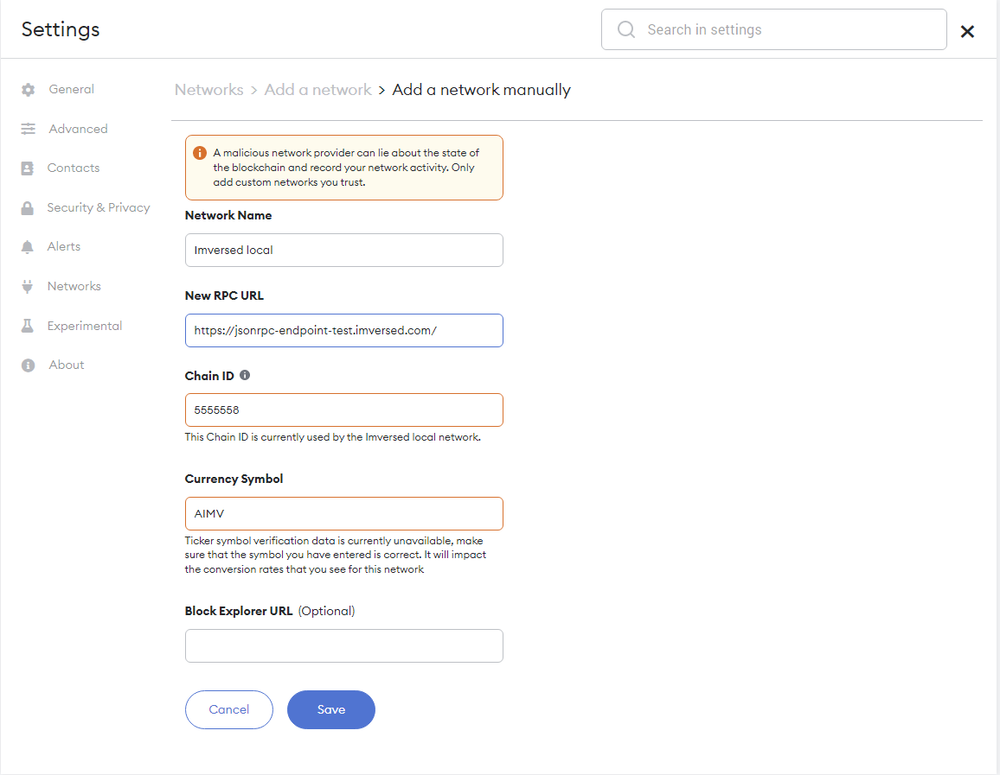
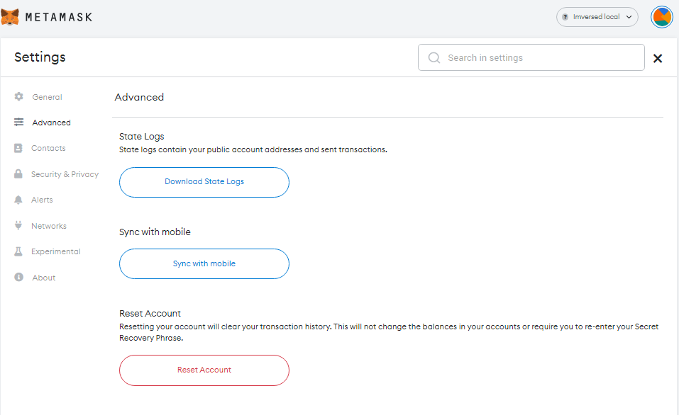

# Digital Wallets

## MetaMask

```List

SYNOPSIS
Connect your Metamask wallet with Imversed.`

```

The [MetaMask](https://metamask.io/) browser extension is a wallet for accessing Ethereum-enabled applications and managing user identities. It can be used to connect to Evmos through the official testnet or via a locally-running Imversed node.

::: tip

If you are planning on developing on Imversed locally and you haven’t already set up your own local node, refer to the `[quickstart tutorial](Link to quickstart tuntorial)`, or follow the instructions in the [GitHub repository](https://github.com/imversed/imversed)

:::

## Adding a New Network

Open the MetaMask extension on your browser, you may have to log in to your MetaMask account if you are not already. Then click the top right circle and go to `Settings` > `Networks` > `Add Network` and fill the form as shown below.

::: tip

You can also lookup the [EIP155](https://github.com/ethereum/EIPs/blob/master/EIPS/eip-155.md) `Chain ID` by referring to [chainlist.org](https://chainlist.org/). Alternatively, to get the full Chain ID from Genesis, check the `[Chain ID](Link to page)` documentation page.

:::



Here is the list of fields that you can use to paste on Metamask:

:::: tabs ::: tab Mainnet

- Network Name: `Imversed Mainnet`

- New RPC URL: 

- Chain ID: 

- Currency Symbol (optional): `AIMV`

- Block Explorer URL (optional): `n/a` ::: ::: tab Testnet

- Network Name: `Imversed Testnet`

- New RPC URL: `https://jsonrpc-endpoint-test.imversed.com:443/`

- Chain ID: `5555558`

- Currency Symbol (optional): `AIMV`

- Block Explorer URL (optional):  ::: ::: tab Local Node

- Network Name: Imversed Local

- New RPC URL: `https://jsonrpc-endpoint-test.imversed.com:443/`

- Chain ID: `5555558`

- Currency Symbol (optional): `AIMV`

- Block Explorer URL (optional): `https://txe-test.imversed.com/` ::: ::::

## Import Account to Metamask

### Automatic Import

Once you have added Imversed to the Metamask Networks, you can automatically import your accounts by:

1. Go to the official EVM Chain ID Registry website: [chainlist.org](https://chainlist.org/)
2. Search for `"Imversed"`

``` List

Here will be picture chainlist.org

```

## Manual Import

Close the Settings, go to My Accounts (top right circle) and select Import Account. You should see an image like the following one:

``` List

Here will be picture from metamask extension

```

Now you can export your private key from the terminal using the following command. Again, make sure to replace `mykey` with the name of the key that you want to export and use the correct `keyring-backend`:

``` List

Here will be picture command like `evmosd keys unsafe-export-eth-key mykey`

```

Go back to the browser and select the `Private Key` option. Then paste the private key exported from the `unsafe-export-eth-key` command.

Your account balance should show up as [`1 tImversed` here we need to more info] and do transfers as usual.

::: tip

If it takes some time to load the balance of the account, change the network to `Main Ethereum Network` (or any other than `Localhost 8545` or `Imversed`) and then switch back to `Imversed`.

:::

## Reset Account

If you used your Metamask account for a legacy testnet/mainnet upgrade, you will need to reset your account in order to use it with the new network. This will clear your account's transaction history, but it won't change the balances in your accounts or require you to re-enter your `Secret Recovery Phrase`.

::: tip

Make sure you download your account state to persist public account addresses and transactions before clearing your wallet accounts.

:::

Go to `Settings` > `Advanced` and click the `Reset Account` button as shown below:




## Download Account State

To see your Metamask logs, click the top right circle and go to `Settings` > `Advanced` > `State Logs`. If you search through the JSON file for the account address you'll find the transaction history.

<!-- ## Keplr

```List

Connect your Keplr wallet with Imversed

```
::: tip

The Keplr extension is officially supported only on Chromium-based explorers.

:::

The [Keplr](https://www.keplr.app/) browser extension is a wallet for accessing applications in the Imversed ecosystem and managing user identities. It can be used to connect to Imversed through the official testnet and request Funds from the Faucet.

-->

## Backup

```List
Learn how to backup your wallet's mnemonic and private key.

```

## Mnemonics

When you create a new key, you'll recieve a mnemonic phrase that can be used to restore that key. 

Backup the mnemonic phrase:

```List

Coming soon

```

To restore the key:


```List

Coming soon

```

## Export Key

### Tendermint-Formatted Private Keys

To backup this type of key without the mnemonic phrase, do the following:

```List

Coming soon

```

## Ethereum-Formatted Private Keys

::: tip 

Note: These types of keys are MetaMask-compatible.

:::

To backup this type of key without the mnemonic phrase, do the following:

```List

Coming soon

```

## Import Key

### Tendermint-Formatted Private Keys

```List

Coming soon

```
### Ethereum-Formatted Private Keys


```List

Coming soon

```

### Verification

Verify that your key has been restored using the following command:

```List

Coming soon

```


